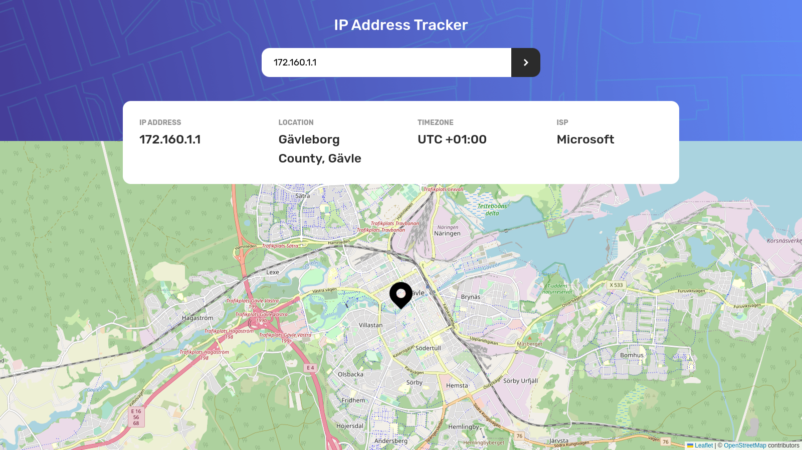
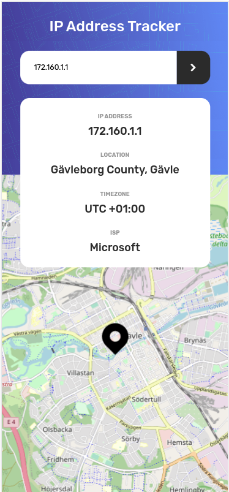

# IP address tracker solution
. 

## Table of contents

- [Overview](#overview)
  - [The challenge](#the-challenge)
  - [Screenshot](#screenshot)
  - [Links](#links)
- [My process](#my-process)
  - [Built with](#built-with)
  - [What I learned](#what-i-learned)

## Overview

### The challenge

Users should be able to:

- View the optimal layout for each page depending on their device's screen size
- See hover states for all interactive elements on the page
- See their own IP address on the map on the initial page load
- Search for any IP addresses or domains and see the key information and location

### Screenshot

### Links
- Live Site URL: [IP Address Tracker](https://ip-address-tracker-e2ks.onrender.com)

## My process

### Built with

- [React](https://reactjs.org/) - JS library
- [Axios](https://axios-http.com/) - Promise based HTTP client
- [TailwindCSS](https://tailwindcss.com/) - For styles
- [PostCSS](https://postcss.org/) - a tool for transforming CSS with JavaScript
- [Leaflet](https://leafletjs.com/) - an open-source JavaScript library for mobile-friendly interactive maps
- [React Leaflet](https://react-leaflet.js.org/) - React components for Leaflet maps
- [IP Geolocation API](https://geo.ipify.org/) - A real-time IP Geolocation API

### What I learned

As my first try using a map API, Leaflet was a great tool to achieve that. At first, it was a challenge to incorporate it in ReactJS, but after find the React Leaflet components, the proccess became easier.
